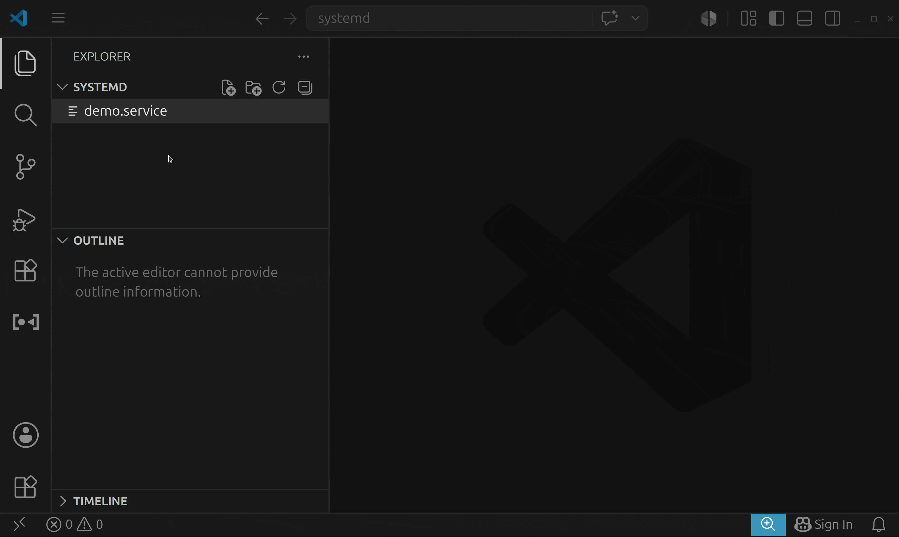
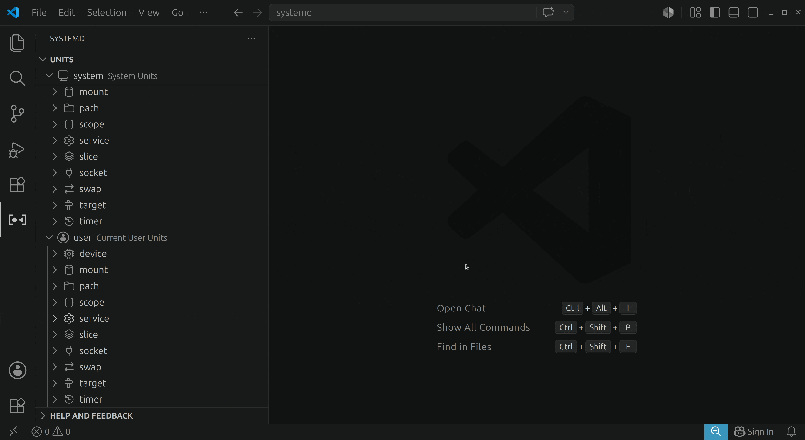
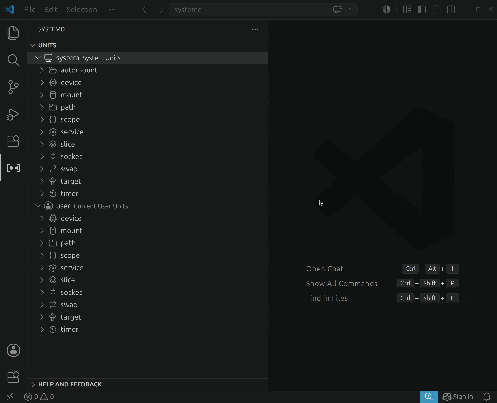
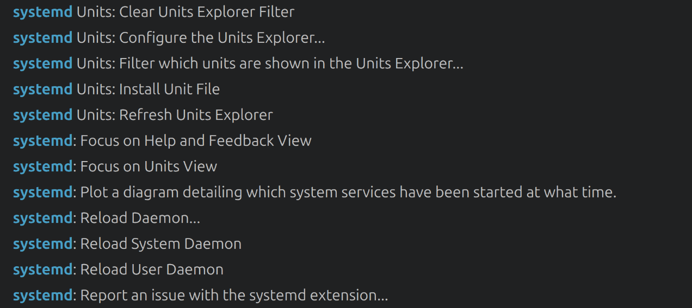
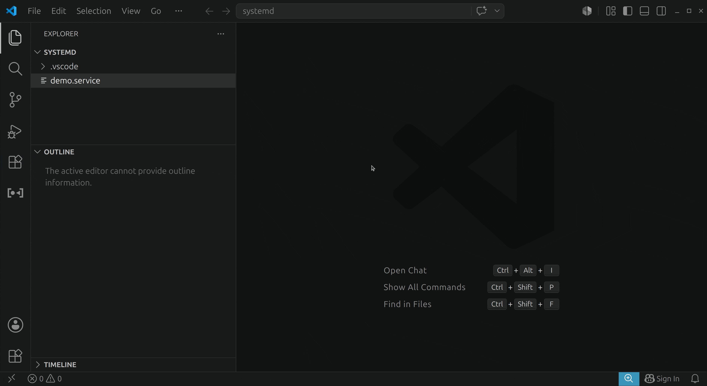
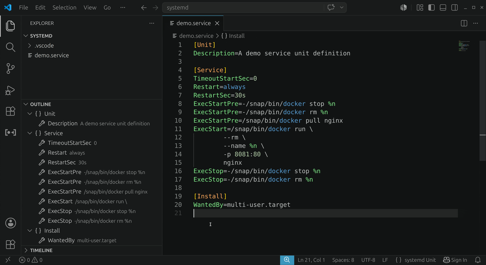

> ℹ️ **This extension is still in development. Please share your feedback/thoughts by submitting or commenting on [issues](https://github.com/dviererbe/vscode-systemd/issues), [pull requests](https://github.com/dviererbe/vscode-systemd/pulls) or [discussions](https://github.com/dviererbe/vscode-systemd/discussions).**

# systemd extension for Visual Studio Code

  

The systemd extension makes it easy to inspect, manage, and create systemd units from Visual Studio Code.

## Prerequisites

This extension uses the [`systemctl(1)`](https://www.freedesktop.org/software/systemd/man/latest/systemctl.html) and [`systemd-analyze(1)`](https://www.freedesktop.org/software/systemd/man/latest/systemd-analyze.html) commands to interact with and analyze systemd units. The [`pkexec(1)`](https://manpages.ubuntu.com/manpages/latest/man1/pkexec.1.html) command is used to elevate priveledges when interacting with system units.

If your environment does not contain these commands the extension will not work properly.

## Overview of the extension features

### Editing systemd unit files

This extension provides basic IntelliSense when editing your systemd unit files including syntax highlighting, document outlines, folding ranges, property descriptions on hover, and unit symbol definitions.

> ℹ️ This feature is a currently in it's early stages and not feature complete yet. It will be extened in future releases.

### Units Explorer

This extension contributes a Units Explorer view to VS Code. The Units Explorer lets you examine and manage units.

The right-click menu provides access to commonly used commands for each type of asset.

The Units Explorer supports comprehensive configuration: group and sort units, apply a filter, and customize the label, description, and icon displayed for each unit.

### Unit commands

Commands to interfact with units are built right into the Command Palette:

### Snippets

Snippets can be used to speed up writing/editing unit files:

### Install unit files

Install unit files from the active editor or the file explorer:

### Inspect system startup times

Plot which system services have been started at what time, highlighting the time they spent on initialization:

## Credit

This extension is inspired by and contains some of the code of:

- [vscode-containers](https://github.com/microsoft/vscode-containers) extension (License: MIT)
- [systemd-unit-file](https://github.com/bearmini/vscode-systemd-unit-file) extension (License: MIT)

## License

vscode-systemd    
Copyright (C) 2026 Dominik Viererbe \<hello@dviererbe.de\>

This program is free software: you can redistribute it and/or modify
it under the terms of the GNU Affero General Public License as
published by the Free Software Foundation, either version 3 of the
License, or (at your option) any later version.

This program is distributed in the hope that it will be useful,
but WITHOUT ANY WARRANTY; without even the implied warranty of
MERCHANTABILITY or FITNESS FOR A PARTICULAR PURPOSE.  See the
GNU Affero General Public License for more details.

You should have received a copy of the GNU Affero General Public License
along with this program.  If not, see <https://www.gnu.org/licenses/>.
